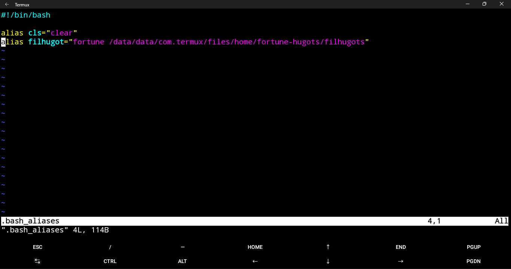
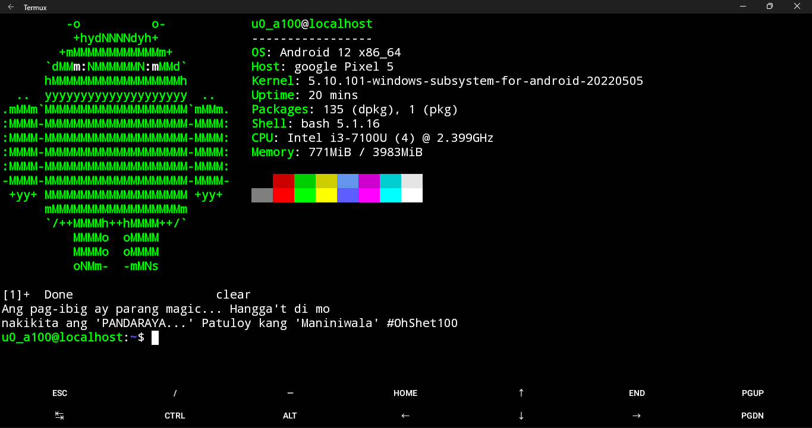

# Welcome to fortune-hugots!

## Description:
*Fortune-Hugots* is a fortune file containing Filipino Hugot (Love) Lines. Available in Filipino/Tagalog, English, Bisaya/Cebuano languages (Added soon).
# Preparation:
## Installing requirements
Install the following packages in your Linux system:
- **git** *is used to clone the repository*
- **fortune** or **fortune-mod** *is the fortune app itself*

> Note: Please consult your package manager in your Linux Distribution on what are the available names for fortunes.
## Installing fortune-hugots
1. Use the following command to clone the repository to your current directory:

   ` git clone https://github.com/CedMIX-Productions/fortune-hugots `
2.  Change directory to the fortune-hugots folder using:

     ` cd fortune-hugots ` 
   
3. Copy the *filhugots*  and *filhugots.dat* files to the directory */usr/share/games/fortunes* using the following commands (superuser required):

    - `sudo cp filhugots /usr/share/games/fortunes/` 
    - `sudo cp filhugots.dat /usr/share/games/fortunes/ ` 
4. Check your work using the following command:

    `fortune filhugots` 

## Installing fortune-hugots in Termux (or use it as an alias)
1. Use the following command to clone the repository to your current (home) directory:

    `git clone https://github.com/CedMIX-Productions/fortune-hugots`

2. Go back to your home directory using:

   ` cd`

3. Edit the *.bash_aliases* file using any text editor you like by using:

    `nano .bash_aliases`
4.  Add the following lines to .bash_aliases
    
    
    `alias filhugot="fortune /data/data/com.termux/files/home/fortune-hugots/filhugots"`
5. Save and quit your work using the following steps:

   - Ctrl + X to exit
   - Then hit Y to save changes
   - Then hit Enter/Return to confirm the file save
   
6. Refresh the *.bashrc* file using the following command:
    
    `clear & source .bashrc`
7. Check your work using the defined alias:

    `filhugots`

